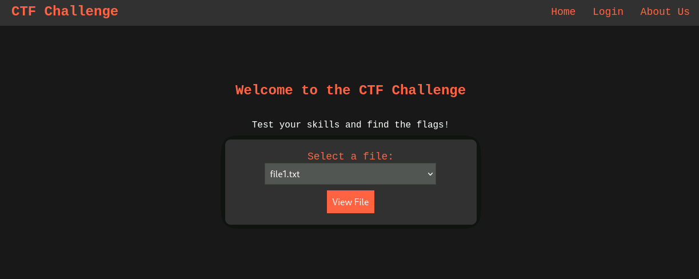
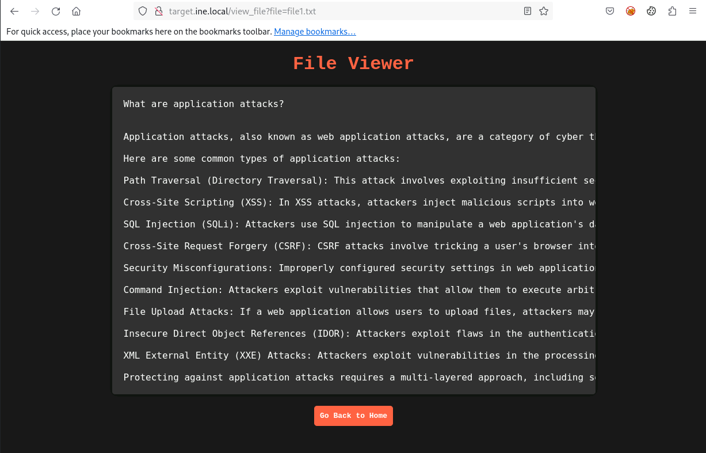
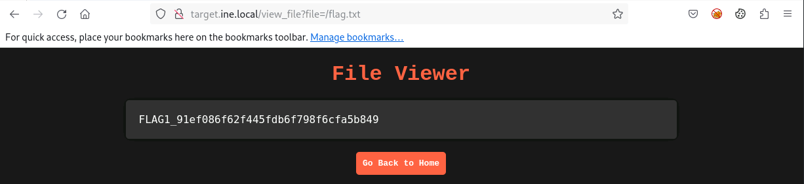
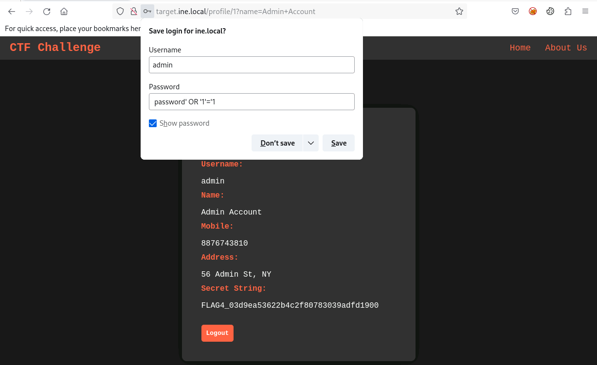

# Web Application Penetration Testing CTF 1
### Capture The Flag Lab Writeup

---

## Table of Contents

1. [Introduction](#1-introduction)
2. [Lab Environment Overview](#2-lab-environment-overview)
3. [Initial Reconnaissance](#3-initial-reconnaissance)
4. [Flag 1: Path Traversal via the File View Parameter](#4-flag-1-path-traversal-via-the-file-view-parameter)
5. [Flag 2: Directory Enumeration with Gobuster](#5-flag-2-directory-enumeration-with-gobuster)
6. [Flag 3: Login Form Brute-Force with Hydra](#6-flag-3-login-form-brute-force-with-hydra)
7. [Flag 4: SQL Injection Authentication Bypass](#7-flag-4-sql-injection-authentication-bypass)
8. [Summary of Findings](#8-summary-of-findings)
9. [Conclusions and Lessons Learned](#9-conclusions-and-lessons-learned)

---

## 1. Introduction

This report documents the methodology, tools, and findings from a Capture The Flag (CTF) lab exercise titled **Web Application Penetration Testing CTF 1**. The lab targeted a single web application and required the identification and exploitation of four distinct web application vulnerabilities: a path traversal flaw, a directory enumeration weakness, a weak authentication brute-force vector, and a SQL injection authentication bypass.

The techniques exercised in this lab include:

- **Service reconnaissance** using Nmap
- **Path traversal exploitation** via a vulnerable file view parameter
- **Directory and file enumeration** using Gobuster
- **HTML source code review** to extract login form field names
- **HTTP POST form brute-forcing** using Hydra, including troubleshooting an incorrect success condition
- **SQL injection** to bypass authentication and gain administrative access

All activities were performed within an isolated, authorised lab environment. No live or production systems were involved.

---

## 2. Lab Environment Overview

| Parameter        | Details                                                              |
|-------------------|---------------------------------------------------------------------------|
| Attacker Machine  | Kali Linux (GUI access provided)                                          |
| Target URL        | `http://target.ine.local`                                                 |
| Target Framework  | Python (gunicorn WSGI server)                                             |
| Wordlists Used    | `/usr/share/wordlists/dirb/common.txt`, `/usr/share/seclists/Usernames/top-usernames-shortlist.txt`, `/root/Desktop/wordlists/100-common-passwords.txt` |

### Tools Used

| Tool        | Purpose                                                       |
|--------------|-------------------------------------------------------------------|
| `nmap`       | Port scanning and service/version detection                       |
| `Gobuster`   | Directory and file enumeration                                     |
| `Hydra`      | HTTP POST login form brute-forcing                                 |
| Web Browser  | Manual application interaction, parameter manipulation, source review |

### Flags and Objectives

| Flag   | Objective                                                                          |
|--------|-----------------------------------------------------------------------------------|
| Flag 1 | Locate and read a file named `flag.txt` stored in the server's root (`/`) directory |
| Flag 2 | Enumerate the server's directory structure to uncover a hidden resource            |
| Flag 3 | Exploit weak login form credentials                                               |
| Flag 4 | Bypass the login form via injection to access the `admin` account                  |

---

## 3. Initial Reconnaissance

A full TCP port scan with service version detection was performed against the target.

### Command Used

```bash
nmap -sV -p- target.ine.local
```

### Results

```
PORT   STATE SERVICE VERSION
80/tcp open  http    gunicorn
```

### Analysis

The scan revealed a single exposed service: an HTTP server running behind **gunicorn**, a Python WSGI server commonly used to serve Flask or Django applications. This indicated that the target was very likely a Python-based web application, a detail that later proved consistent with the application's behaviour during the SQL injection testing phase.

---

## 4. Flag 1: Path Traversal via the File View Parameter

### Hint

> "Sometimes, important files are hidden in plain sight. Check the root ('/') directory for a file named 'flag.txt' that might hold the key to the first flag."

### Methodology

An initial manual review of the site was conducted to understand its structure and available functionality.

### Step 1: Explore the Application

The homepage presented a CTF challenge platform landing page with three navigation options: Home, Login, and About Us. The About Us page returned a short description of the platform's purpose, offering no immediate leads. The Home page displayed a file viewing feature, allowing the user to select a file from a dropdown box and view its contents in the browser.



Selecting a file from the dropdown and clicking "View File" displayed the file's contents directly in the page.



### Step 2: Analyse the URL Structure

Reviewing the browser's address bar while viewing a file revealed the following URL pattern:

```
http://target.ine.local/view_file?file=file1.txt
```

This indicated that the `file` parameter was passed directly to the server and used to determine which file to read and display, a pattern commonly associated with local file inclusion or path traversal vulnerabilities when the parameter is not properly sanitised or restricted to a specific directory.

### Step 3: Exploit the Parameter to Read an Arbitrary File

The `file` parameter was modified to reference an absolute path outside of the application's intended file directory, targeting the root-level flag file referenced in the lab hint:

```
http://target.ine.local/view_file?file=/flag.txt
```

This request successfully returned the contents of the flag file stored in the server's root directory.



### Analysis

The `view_file` endpoint accepted a filename parameter and passed it, without adequate validation, directly to a file read operation on the server's file system. By supplying an absolute path (`/flag.txt`) rather than a bare filename, the application's intended restriction to its own designated file directory was bypassed entirely, a classic example of a path traversal (or local file inclusion) vulnerability arising from insufficient input validation on a user-controlled file path parameter.

### Flag Captured

```
FLAG1_################################
```

---

## 5. Flag 2: Directory Enumeration with Gobuster

### Hint

> "Explore the structure of the server's directories. Enumeration might reveal hidden treasures."

### Methodology

The lab hint, combined with the explicitly suggested tool and wordlist, indicated that directory brute-forcing was the intended approach for this flag.

### Step 1: Enumerate Directories with Gobuster

```bash
gobuster dir -u http://target.ine.local -w /usr/share/wordlists/dirb/common.txt
```

**Results:**

```
/about       (Status: 200) [Size: 2858]
/login       (Status: 200) [Size: 3377]
/logout      (Status: 302) [Size: 189] [--> /]
/secured     (Status: 308) [Size: 251] [--> http://target.ine.local/secured/]
```

Among the discovered paths, `/secured` stood out as the most likely candidate for containing sensitive content, given its name and the fact that it issued a redirect to a trailing-slash version of itself, typically indicative of a directory listing.

### Step 2: Explore the Secured Directory

Navigating to `http://target.ine.local/secured/` in the browser returned a JSON response listing the directory's contents:

```json
["flag.txt"]
```

### Step 3: Retrieve the Flag

```
http://target.ine.local/secured/flag.txt
```

```
FLAG2_################################
```

### Analysis

The `/secured` directory, despite its name suggesting restricted access, was reachable without any authentication and exposed a directory listing that directly revealed the presence of a flag file. This represents a straightforward but common web server misconfiguration: a directory intended to imply restricted access provided neither an authentication requirement nor protection against directory listing, allowing any unauthenticated visitor to enumerate and retrieve its contents.

### Flag Captured

```
FLAG2_################################
```

---

## 6. Flag 3: Login Form Brute-Force with Hydra

### Hint

> "The login form seems a bit weak. Trying out different combinations might just reveal the next flag."

### Methodology

The hint suggested that the login form was susceptible to a credential brute-force attack. Before configuring Hydra, the login page's HTML source was reviewed to determine the exact field names used by the form.

### Step 1: Review the Login Form Source

Inspecting the page source of the login form revealed the following relevant markup:

```html
<label for="username">Username:</label>
<input type="text" id="username" name="username" required>
<label for="password">Password:</label>
<input type="password" id="password" name="password" required>
<input type="submit" value="Log In">
```

This confirmed the exact field names (`username` and `password`) required to correctly construct the Hydra HTTP POST form attack string.

### Step 2: First Brute-Force Attempt (Incorrect Success Condition)

```bash
hydra -L /usr/share/seclists/Usernames/top-usernames-shortlist.txt \
      -P /root/Desktop/wordlists/100-common-passwords.txt \
      target.ine.local \
      http-post-form \
      "/login:username=^USER^&password=^PASS^:S=200"
```

This initial attempt used `S=200` as the success condition, indicating that any HTTP 200 response should be treated as a successful login. This proved to be an incorrect assumption: the application returned an HTTP 200 status code for every submission, including failed login attempts, since the server was responding with "you submitted your credentials successfully" rather than reserving the 200 status specifically for a verified successful login. As a result, every single combination in the wordlist was incorrectly reported as valid.

### Step 3: Second Brute-Force Attempt (Corrected Success Condition)

Recognising that a successful login likely triggered an HTTP redirect rather than a plain 200 response, the success condition was changed to `S=302`:

```bash
hydra -L /usr/share/seclists/Usernames/top-usernames-shortlist.txt \
      -P /root/Desktop/wordlists/100-common-passwords.txt \
      target.ine.local \
      http-post-form \
      "/login:username=^USER^&password=^PASS^:S=302"
```

**Result:**

```
[80][http-post-form] host: target.ine.local   login: guest   password: butterfly1
```

Valid credentials were recovered: `guest:butterfly1`.

### Step 4: Authenticate and Retrieve the Flag

The recovered credentials were submitted through the login form in the browser, successfully authenticating and returning a user profile page:

```
User Profile
Username: guest
Name: Bob Guest
Mobile: 9876543810
Address: 456 Adam St, NY
Secret String: FLAG3_################################
```

### Analysis

The `guest` account was protected by a password present in a list of the 100 most common passwords, allowing it to be recovered through a straightforward dictionary attack. The troubleshooting step involving the HTTP status code is a useful illustration of a common pitfall when automating login brute-force attacks: the correct success or failure condition must be determined empirically by observing the application's actual behaviour, rather than assumed from typical conventions, since a login form providing an uninformative or misleading initial response (in this case, a 200 status for both success and failure at the form submission stage) can cause a brute-force tool to produce entirely false results if misconfigured.

### Flag Captured

```
FLAG3_################################
```

---

## 7. Flag 4: SQL Injection Authentication Bypass

### Hint

> "The login form behaves oddly with unexpected inputs. Think of injection techniques to access the 'admin' account and find the flag."

### Methodology

The hint clearly pointed toward a SQL injection vulnerability in the login form. Before crafting a full injection payload, the form's behaviour under unexpected input was verified manually.

### Step 1: Confirm Unexpected Behaviour

Submitting the username `admin` with the password `password'` (a single unescaped quotation mark appended to an arbitrary value) resulted in an internal server error being returned by the application. This strongly suggested that user input was being inserted directly into a backend SQL query without proper sanitisation or parameterisation, causing the injected quotation mark to break the query's syntax.

### Step 2: Reason About the Underlying Query

The likely structure of the backend authentication query was inferred as follows:

```sql
SELECT *
FROM user
WHERE username='admin' AND password='password'
```

If the password field were injectable, submitting a value designed to always evaluate as true, regardless of the actual stored password, could bypass the password check entirely while still matching the intended `username='admin'` condition.

### Step 3: Construct and Submit the Injection Payload

The following password value was submitted, using the username `admin`:

```
password' OR '1'='1
```

This input was designed to transform the backend query into the following form:

```sql
SELECT *
FROM user
WHERE username='admin' AND password='password' OR '1'='1'
```

Due to standard SQL operator precedence, this query evaluates as `(username='admin' AND password='password') OR ('1'='1')`. Since the condition `'1'='1'` is always true, the overall `WHERE` clause evaluates as true for the first row returned by the database regardless of the actual password value, which, combined with the explicit `username='admin'` condition in the first half of the clause, resulted in successful authentication as the `admin` account.

### Step 4: Confirm Successful Login and Retrieve the Flag

Submitting the crafted payload through the login form resulted in successful authentication as the `admin` user, with the corresponding flag displayed on the resulting profile page.



### Analysis

This vulnerability is a textbook example of a classic SQL injection authentication bypass, arising from the direct concatenation of unsanitised user input into a SQL query string rather than the use of parameterised queries or prepared statements. The internal server error observed during the initial single-quote test was itself a valuable diagnostic signal, confirming that user input was reaching the database layer unescaped before any injection payload was attempted. The specific `OR '1'='1'` technique used here is one of the most well known SQL injection patterns and remains effective against any application that builds SQL queries through direct string concatenation of user-supplied values.

### Flag Captured

```
FLAG4_################################
```

---

## 8. Summary of Findings

| Flag   | Vulnerability                                        | Technique                                              | Risk     |
|--------|----------------------------------------------------------|-------------------------------------------------------------|----------|
| Flag 1 | Path traversal via unsanitised `file` parameter          | Direct absolute path substitution in `view_file` endpoint    | Critical |
| Flag 2 | Directory listing on a nominally "secured" path          | Gobuster enumeration and manual browsing                     | High     |
| Flag 3 | Weak password on the `guest` account                     | Hydra HTTP POST form brute-force                              | High     |
| Flag 4 | SQL injection in the login form                          | `OR '1'='1'` authentication bypass payload                    | Critical |

### Vulnerabilities Identified

1. **Path Traversal / Local File Inclusion in view_file:** The `file` GET parameter was passed to a file read operation without restricting it to a designated directory or sanitising path traversal sequences, allowing arbitrary file access anywhere on the server's file system that the web application process had permission to read.

2. **Directory Listing on the /secured Path:** A directory named `/secured`, despite its name implying restricted access, was reachable without authentication and exposed a full directory listing, directly revealing the presence and location of a sensitive file.

3. **Weak Password on the guest Account:** The `guest` account's password was present in a commonly used top-100 password list, making it trivially recoverable through an automated dictionary attack against the login form.

4. **SQL Injection in the Login Form:** User-supplied input in both the username and password fields was concatenated directly into a backend SQL query without sanitisation or the use of parameterised statements, allowing a classic `OR '1'='1'` payload to bypass password verification entirely and authenticate as an arbitrary user, including the `admin` account.

---

## 9. Conclusions and Lessons Learned

This lab demonstrated four distinct and independently exploitable web application vulnerabilities, ranging from basic misconfigurations (an exposed directory listing) to fundamental input handling failures (path traversal and SQL injection). Each flag required a different category of technique, providing broad coverage of common web application penetration testing skills within a single, contained target.

### Attack Chain Summary

```
Nmap Scan
    -> gunicorn (Python WSGI) identified on port 80

Manual Application Review
    -> view_file?file= parameter identified
            -> Path traversal: file=/flag.txt
                    -> FLAG 1 retrieved

Gobuster Directory Enumeration
    -> /secured discovered
            -> Directory listing exposed: flag.txt
                    -> FLAG 2 retrieved

Login Form Source Review
    -> Field names confirmed: username, password

Hydra Brute-Force (S=200: failed, false positives)
Hydra Brute-Force (S=302: corrected)
    -> guest:butterfly1 recovered
            -> FLAG 3 retrieved

Manual SQL Injection Testing
    -> Single quote in password: Internal Server Error (confirms injection point)
            -> Payload: password' OR '1'='1
                    -> Authentication bypass as admin
                            -> FLAG 4 retrieved
```

### Key Takeaways

- **User-controlled file paths must always be validated against a strict allowlist.** The `view_file` endpoint's failure to restrict its `file` parameter to a specific, intended directory allowed trivial access to any file readable by the web server process. Applications requiring file selection functionality should map user selections to a fixed, server-side list of permitted files rather than accepting arbitrary path input.

- **A directory's name is not a security control.** Naming a path `/secured` provides no actual protection; genuine access restriction requires authentication middleware and explicit denial of directory listing at the web server or application framework level.

- **Automating login brute-force attacks requires empirical verification of the application's actual response behaviour.** An incorrect assumption about what constitutes a "successful" response (in this case, assuming HTTP 200 rather than the correct HTTP 302 redirect) can cause a brute-force tool to report false positives for every attempted combination, wasting time and producing misleading results.

- **SQL injection remains a critical and highly impactful vulnerability class.** The classic `OR '1'='1'` authentication bypass technique, despite being decades old, remains fully effective against any application that constructs SQL queries via direct string concatenation of user input. The only reliable mitigation is the consistent use of parameterised queries or prepared statements at the database access layer, never string concatenation, regardless of any input sanitisation attempted elsewhere in the application.

- **Unexpected error responses are valuable diagnostic signals.** The internal server error triggered by a single unescaped quotation mark in the password field was the critical piece of evidence confirming that user input was reaching the database layer unsanitised, well before any full injection payload was constructed.

---

*Report completed: July 8, 2026*
*Lab: Web Application Penetration Testing CTF 1*
*Platform: INE Security / eLearnSecurity*
